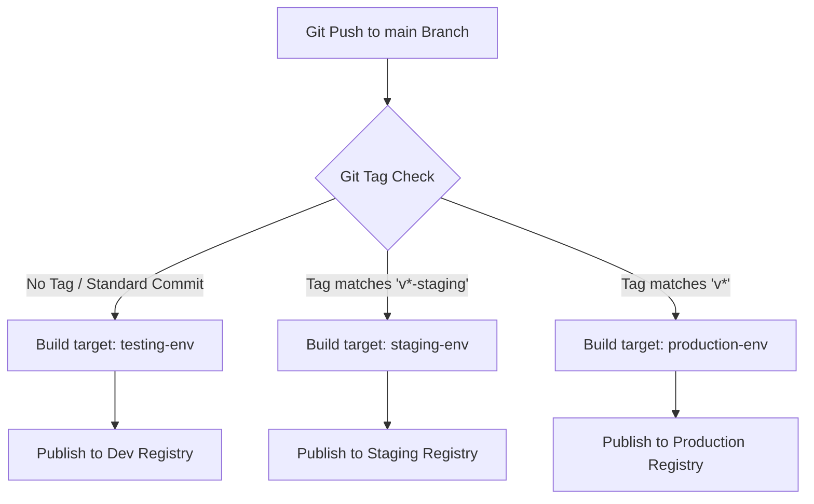

# Dynamic CI/CD Pipeline Orchestration (Frontend)

This skill translates Git Tag configurations into target container deployments for the Next.js static asset tree.

---

## 🛰️ Pipeline Tag Routing Logic

Our pipeline routes pushes on the `main` branch to specific container stages based on Git Tag signatures.

---

## 📝 Specifications

* **No Git Tag (Development/PR Check)**:
  * Targets `testing-env`.
  * Runs lints and dev builds.
* **Staging Promotion (`v*-staging`)**:
  * Targets `staging-env`.
* **Production Release (`v*` e.g., `v1.2.3`)**:
  * Targets `production-env`.
